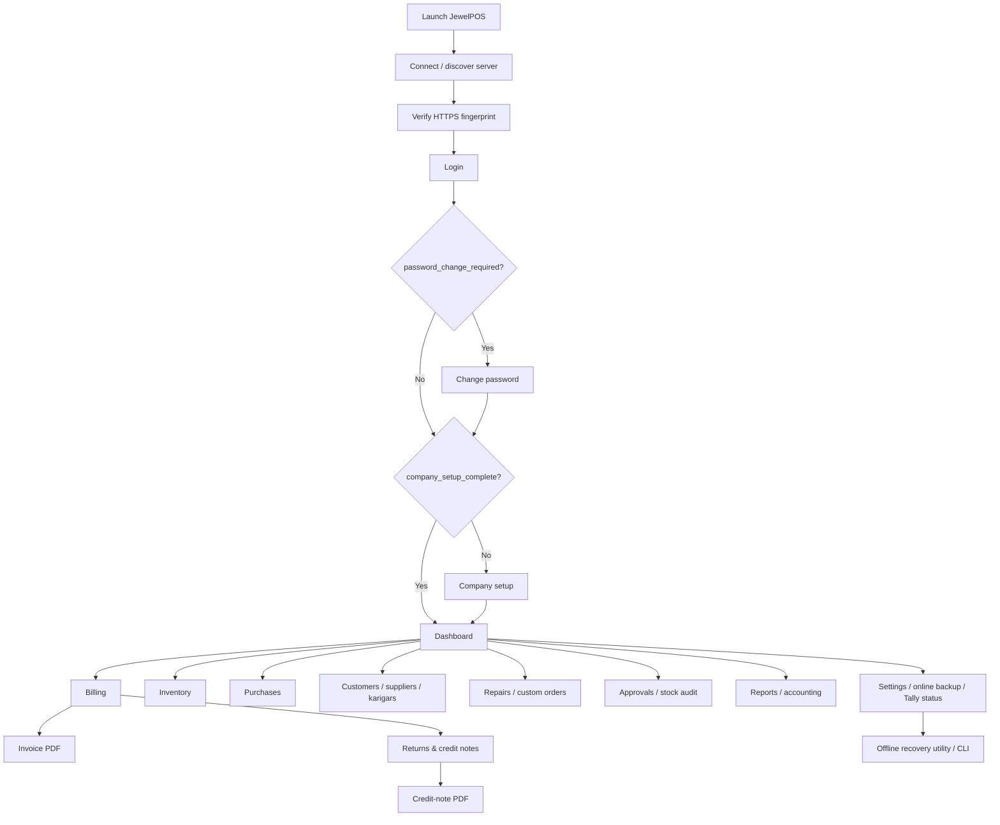

# JewelLAN App Flow

**Purpose:** screen map and primary user journeys

## 1. Screen map

The text equivalent is: Launch → Connect → Verify server identity → Login → independently satisfy password-change and company-setup conditions → Dashboard → select a module → complete or cancel the workflow → return to the module or Dashboard.

## 2. Global navigation and states

Every authenticated screen provides:

- Current company/branch/counter context.
- Branch and counter are selected before a cart is opened and cannot change mid-cart; branch scope is enforced by the server.
- Current user and role.
- Navigation to permitted modules.
- A visible way to refresh data and return to the dashboard.
- Clear success, warning, and error feedback.
- Session-expiry handling that returns the operator to Login without losing server data.

The client should distinguish between validation errors, permission errors, connectivity errors, server errors, and business conflicts such as “item already sold.”

## 3. First-run flow

1. Launch the client.
2. Discover a JewelLAN server or enter its address manually.
3. Probe the live certificate and show the fingerprint for operator verification.
4. Save the trusted server URL/fingerprint locally on the client.
5. Obtain the one-time bootstrap secret through the local setup path and sign in.
6. If `password_change_required` is true, change the password once and clear only that flag.
7. If `company_setup_complete` is false, complete company and branch setup; a partial failure leaves setup incomplete but does not reset the password flag.
8. Configure users, counters, numbering, tax defaults, backup policy, and optional Tally settings.
9. Create a baseline backup before opening stock is entered.
10. Continue to Dashboard.

## 4. Billing flow

1. Open **Billing counter**.
2. Focus the scanner field; scan or type a tag/barcode and press Enter.
3. The client retrieves the item from the server and adds it to the invoice.
4. The client requests a server quote.
5. Review line-level metal, wastage, making, stone, discount, taxable, GST, and total values.
6. Select a customer or use the walk-in customer.
7. Add old-gold exchange if applicable.
8. Enter invoice discount; the client requotes automatically.
9. Enter split payments and verify that payment total equals the invoice total.
10. The client persists a pending-post record containing request UUID, cart fingerprint, quote ID/hash, branch/counter, payment rows, and state.
11. Press **Post invoice**.
12. The server validates stock, verifies the supplied quote context, checks the idempotency key, and posts the transaction atomically.
13. If pricing inputs changed, the server returns `QUOTE_STALE` plus a fresh quote; the client must not silently change the amount after tender entry.
14. If the response times out, show **Outcome unknown** and query/retry using the same request UUID. Never show a definite failure until the server confirms that no sale exists.
15. After confirmation, show the invoice number and open/print the invoice PDF.
16. Clear the pending record and cart, then return to the ready-to-scan state.

If the client restarts, its Pending Posts view restores all non-final records and offers reconciliation. A confirmed sale is displayed as the original result; a rejected/absent sale can be retried only with the same cart fingerprint and request UUID. If the item changed state, the client must show a business conflict and require operator review.

## 5. Return flow

1. Open **Returns & Credit Notes**.
2. Search for and select the original invoice.
3. Review the serialized sale lines and returnable state.
4. Select one or more tags.
5. Request a return quote based on original values, including deterministic partial-return allocation.
6. Choose a disposition per selected tag: saleable stock, quarantine/review, damaged, or scrap.
7. Enter refund split and reason; the client persists a return request UUID before posting.
8. Post the credit note.
9. The server checks the return idempotency key and unique active sale-line constraint, creates reversal history, and applies the selected disposition.
10. On timeout, reconcile the same request UUID before allowing another attempt.
11. Show the credit-note number and open/print the PDF.

## 6. Stock and purchase flow

### Purchase / stock-in

Select supplier → enter purchase item details → assign tag/barcode → verify weights and cost → post purchase → print labels → confirm stock status is `in_stock`.

### Physical stock audit

Start audit and capture an expected-stock snapshot/version → scan barcodes/RFID EPCs → ignore duplicate scans with visible duplicate feedback → review expected/scanned/missing/extra results → close only if no conflicting movement occurred or a manager explicitly resolves it → create a stock-adjustment transaction for approved discrepancies.

### Inventory maintenance

Search item → open item → edit only permitted mutable fields → record a reason for exceptional overrides → save → verify stock movement/history.

## 7. Operational flows

- **Repair:** receive → assign karigar → in progress → ready → delivered/cancelled.
- **Custom order:** create → assign → in progress → ready → delivered/cancelled.
- **Approval/Jangad:** issue → item status becomes approval → return → stock restored and approval closed when complete.
- **Tally:** view bridge/queue status → queued transaction → bridge attempts local delivery → success or visible retry/error state.
- **Online backup management:** create/verify backup → view retention list and independent-copy status. This UI never performs live restore.
- **Offline recovery:** stop JewelServer → run the documented server recovery utility/CLI against a verified backup → start JewelServer → run integrity/data-health/day-close checks.
- **Day close:** review cutoff-period reconciliation → resolve or approve discrepancies → lock the business date → generate evidence → allow only authorized reopen.

## 8. Exit and recovery rules

- Sign out ends the client session; it does not alter posted data.
- Closing a form with unsaved input requires a discard confirmation.
- A confirmed transport-safe rejection keeps the entered cart visible when safe to retry; an uncertain write is always shown as **Outcome unknown**.
- A timed-out write is shown as **Outcome unknown**, not **Failed**.
- A server restart must not create partial business records because business writes are transactional.
