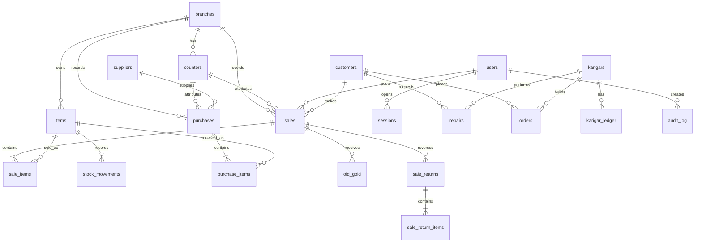

# JewelLAN Backend Schema

**Current source of truth:** schema and migrations in `jewel_server/db.py`. This document also defines required schema extensions and invariants that must be migrated before the related workflows are production-ready.
**Storage:** one SQLite database owned by JewelServer on the main Windows PC

## 1. Storage rules

- The database is local to the server PC; it must not be placed on an SMB/network share.
- Connections enable foreign keys, WAL journaling, full synchronous durability, busy timeout, and bounded WAL checkpoints.
- Reads use query-only connections where possible.
- Writes use the application write lock and an immediate transaction.
- Production corrections use business reversal records, not manual SQL edits.
- The current schema version is tracked by the application and upgraded through controlled migrations.

## 2. Core entity map

## 3. Table groups

### Identity and configuration

- `settings`: key/value configuration such as company details, timezone, prefixes, and backup policy.
- `users`: named accounts, role, password hash, active state, and first-login password-change flag.
- `sessions`: hashed session tokens, expiry, last-seen time, and client name.
- `branches`: branch code, name, GSTIN, address, phone, and active state.
- `counters`: counter name linked to a branch.

### Masters

- `customers`: customer identity, contact information, GST details, loyalty/balance projection, and notes.
- `suppliers`: supplier identity, contact information, GST details, payable-balance projection, and notes.
- `karigars`: artisan identity plus cash/metal balance projections.
- `metal_rates`: metal/purity rate history with effective timestamp and author.

### Serialized stock

- `items`: the authoritative physical jewellery item record.
- `stock_movements`: append-only item movement history with movement type, source/destination, reference, actor, and note.

Important `items` fields include:

| Field | Meaning |
|---|---|
| `tag_no`, `barcode` | Unique operator/scanner identifiers |
| `metal`, `purity` | Material classification |
| `gross_weight_mg`, `stone_weight_mg`, `net_weight_mg`, `fine_weight_mg` | Integer canonical physical and derived weights |
| `stone_value`, `cost_amount` | Valuation inputs |
| `making_type`, `making_value`, `wastage_percent` | Pricing rules |
| `huid`, `certificate_no`, `rfid_epc` | Traceability identifiers |
| `hsn_code`, `gst_rate` | Tax classification |
| `status` | `in_stock`, `sold`, `quarantine`, `repair`, `approval`, `karigar`, `transit`, `damaged`, or `scrap` |
| `branch_id`, `counter_id` | Physical ownership/location context |
| `version` | Optimistic/concurrency protection support |

The gram-valued weight columns are display/input compatibility mirrors only. Gross and stone are entered; net is derived as gross minus stone unless a manager-approved override records a reason; fine is derived from net and purity with deterministic rounding. Every mirror must reconcile exactly with its integer milligram field.

### Sales and payments

- `sales`: immutable invoice header, totals, discount, GST, round-off, status, actor, `client_request_id`, branch/counter attribution, and seller/branch/customer/tax printable identity snapshots.
- `sale_items`: immutable sale-time snapshot of tag, description, metal/purity, weights, rate, metal value, wastage, making, stones, discount, taxable value, GST, line total, and cost.
- `old_gold`: exchange material, purity, weights, rate, computed value, and receipt actor.
- `payments` (required): immutable tender rows with sale/collection/return reference, method, amount in paise, account, external reference, timestamp, actor, and status.
- `payment_refunds` (required): immutable refund rows linked to a payment/return and refund account/reference.
- `receivable_ledger` (required): authoritative customer credit, collection, adjustment, and reversal entries; customer balance columns are cached projections.

The legacy payment columns on `sales` are verified mirrors, not the source of truth. Multiple card/UPI rows and reconciliation references are represented by `payments`.

### Returns

- `sale_returns`: credit-note header, original sale relationship, totals, refund split, reason, status, actor, timestamps, and its own `client_request_id` plus request fingerprint.
- `sale_return_items`: selected serialized sale lines and original-value reversal details.

Returns must reference original posted values and create new stock movement/accounting history. Each line stores allocated taxable, GST, round-off, total, cost, and disposition (`in_stock`, `quarantine`, `damaged`, or `scrap`). A partial unique index on effective `sale_item_id` prevents a sale line from being returned twice.

### Purchasing and work management

- `purchases` and `purchase_items`: supplier receipt, serialized item linkage, costs, GST, paid amount, and idempotency.
- `purchases`: also stores immutable branch/counter attribution and seller/supplier/tax snapshots.
- `opening_stock_transactions` and lines (required): opening-stock batch/reference, valuation, stock effects, opening-balance/equity posting, actor, and reversal link.
- `repairs`: customer/item description, dates, karigar, status, estimate, advance, final amount, and notes.
- `orders`: custom-order description, metal/purity, target weight, karigar, status, amount, advance, due date, and notes.
- `karigar_ledger`: metal issue/receive, cash debit/credit, making charges, adjustments, references, and actor.
- `approvals` and related approval-item records: temporary customer/item issue and return tracking.

### Accounting, audit, and operations

- Journal header/line tables record balanced double-entry postings.
- Account master tables define cash, bank/card/UPI, receivables, jewellery inventory, old-gold inventory, payables, GST, equity, sales, and COGS accounts.
- Audit tables record append-only actor/action/context records and a verifiable hash chain where enabled.
- Stock-audit tables record an audit session, scanned EPC/barcode values, expected stock, and reconciliation results.
- `stock_adjustments` and lines (required) record approved audit discrepancies, disposition, valuation, actor, reason, and linked stock/journal effects.
- `day_closes` (required) records branch/business date, cutoff timezone, reconciliation result, evidence hash, status, lock/reopen events, actor, and reason.
- `operation_requests` (required) records operation scope, client UUID, payload fingerprint, final result reference, and outcome for server-side idempotency/reconciliation.
- `user_branch_scopes` (required where multi-branch access is enabled) records permitted branch scope and assignment history.
- Tally queue/status tables record asynchronous export attempts, state, retry/error details, references, and a unique stable external event key used for deduplication/reconciliation after lost acknowledgements.

## 4. Integrity rules

- Unique: username, branch code, branch/counter name pair, customer/supplier/karigar codes, tag number, barcode, RFID EPC where present, invoice number, purchase number, operation-scoped client request IDs, and effective returned sale-item IDs.
- Foreign keys are enforced by SQLite.
- Monetary amounts are validated and represented as integer paise in financial tables; any legacy decimal mirrors must reconcile exactly.
- All item weights are integer milligrams in canonical columns; gram display values must reconcile exactly.
- A serialized item can have only one active ownership state at a time.
- Posted sales, sale lines, journals, and stock movements are historical records.
- Cancellation and return actions require explicit status transitions and actor/reason evidence.
- `counter_id` must belong to `branch_id`, enforced by a composite foreign key or equivalent database invariant.
- `expected_version` is required on mutable item updates; mismatches return `VERSION_CONFLICT` and do not overwrite another user’s changes.
- Branch/counter attribution is immutable after posting. A cart may not switch context during a post.

## 5. Numbering and sequence allocation

The existing `sequences` table is the allocator. A number is allocated inside the same immediate write transaction that posts its business record. Sequence scope is explicit—at minimum document type, company/branch, and business year; counter scope is included only if the configured numbering policy requires it. Allocation is monotonic and numbers are never reused. Rollbacks may leave gaps; gaps are recorded as unused transaction numbers and are not backfilled.

## 6. Day-close and data-health invariants

The day-close record locks posting for its branch/business date after successful reconciliation. Data-health must verify at least:

- every journal entry balances in paise;
- payment rows equal sale/return/collection tender totals;
- cached customer, supplier, and karigar balances equal their authoritative ledgers;
- every effective stock status has the required movement history;
- no item is simultaneously sold/returned/approved in contradictory states;
- no effective sale line has more than one return;
- item milligram fields reconcile to display mirrors and derived weight rules;
- branch/counter relationships are valid;
- operation requests have one result or an explicitly unresolved state;
- no open unknown-outcome financial operation remains at day close unless policy explicitly allows it;
- backups have passed verification and an independent-copy requirement.

## 7. Indexing and query expectations

Indexes support session lookup, rate lookup by metal/purity/effective date, customer phone search, item status/branch/HUID/category, stock history by item, sales date/customer, and return/purchase references. List endpoints should use bounded limits and search filters to keep counter screens responsive.

## 8. Data protection and retention

Business data is stored locally under the server application-data directory. Backups include verification metadata and hashes. Backup retention is controlled by server settings. Recovery points are considered valid only after verification and independent-copy checks, and restore is followed by integrity/data-health checks. Backup contents require encryption at rest and restricted administrator/service access because they contain credentials and business data.
